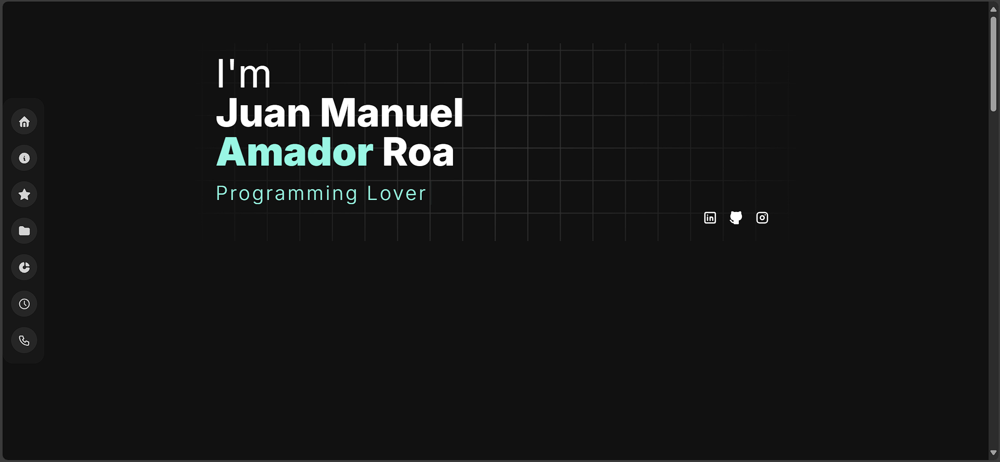
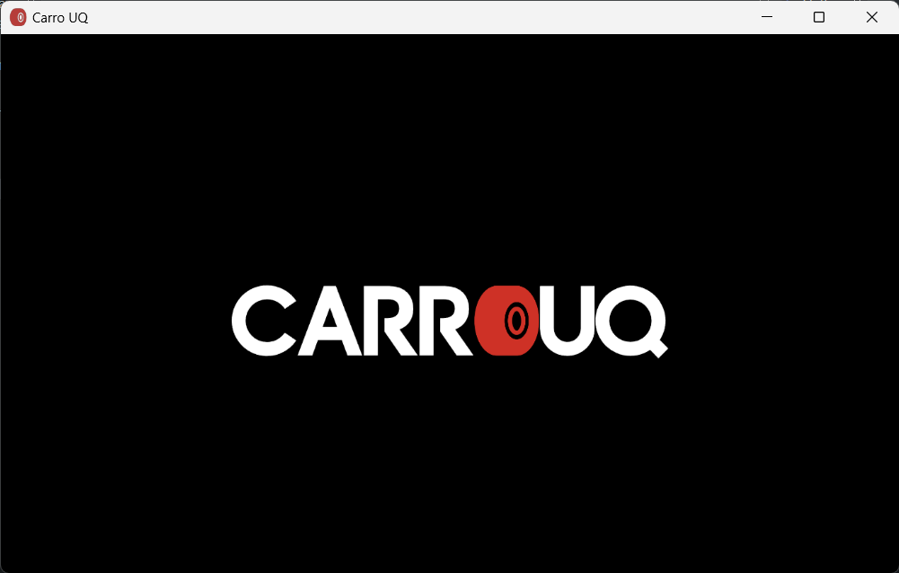
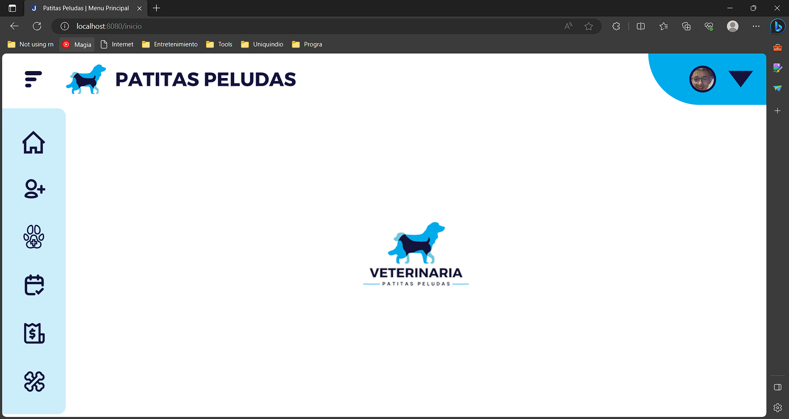

<h3 align="center">
  

    <table>
      <tr>
        <td>
          
        </td>
      </tr>
    </table>
  

</h3>

# Stats

  
  
   
  
  
  

# [EN REMODELACIÓN] Acerca de mí

- 🧑‍🎓 Séptimo semestre en la <a href="https://www.uniquindio.edu.co/">Universidad del Quindío</a>
- 🚧 en remodelación 🚧

  

# [EN REMODELACIÓN] Mi portfolio 

# [OUTDATED] 💻 Lenguajes, frameworks y herramientas

  
   
   

# [OUTDATED] 🔍 Lenguajes, frameworks y herramientas a explorar

   
   

# [OUTDATED] ⭐ Proyectos destacados

|  Ícono                   | Nombre de Proyecto             |  Descripción | Imagen |
:-------------------------:|:-------------------------:|:----------------------|:-------------------------:
🚗 |  Concesionario UQ  |  Este proyecto representa una renovación del sistema de información de una empresa dedicada a la compra, venta y alquiler de vehículos. Se centra en la implementación de un sistema de gestión de vehículos que permite el registro y la administración eficiente de una variedad de vehículos.  |  
🐾 | Clinica Veterinaria | Este proyecto mejora la gestión y atención en una Clinica Veterinaria. La clínica necesitaba una solución eficiente para llevar un registro detallado de la atención de las mascotas por parte de los veterinarios, así como la generación de facturas al finalizar atenciones. El software permite a la clínica mantener un registro preciso de clientes, mascotas, atenciones realizadas, y facturas. | 

